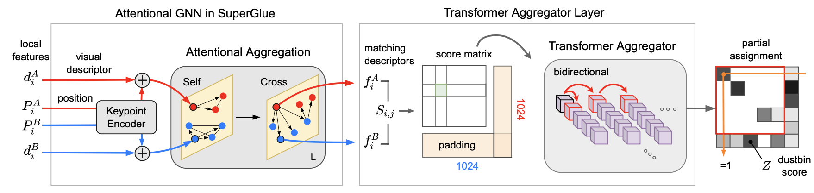
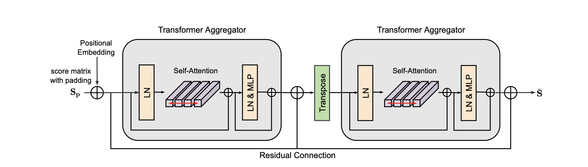

# SuperCATs
For more information, check out the paper on [paper link]. Also check out project page here [Project Page link]. 
*This paper is accepted in ICCE-Asia'22*

>**Cost Aggregation with Transformers for Sparse Correspondence**   
>Abstract : In this work, we introduce a novel network, namely SuperCATs, which aims to find a correspondence field between visually similar images. SuperCATs stands on the shoulder of the recently proposed matching networks, SuperGlue and CATs, taking the merits of both for constructing an integrative framework. Specifically, given keypoints and corresponding descriptors, we first apply attentional aggregation consisting of self- and cross- graph neural network to obtain feature descriptors. Subsequently, we construct a cost volume using the descriptors, which then undergoes a tranformer aggregator for cost aggregation. With this approach, we manage to replace the handcrafted module based on solving an optimal transport problem initially included in SuperGlue with a transformer well known for its global receptive fields, making our approach more robust to severe deformations. We conduct experiments to demonstrate the effectiveness of the proposed method, and show that the proposed model is on par with SuperGlue for both indoor and outdoor scenes.

# Network
Overview of our model is illustrated below:

Structure of Transformer Aggregator is illustrated below:

